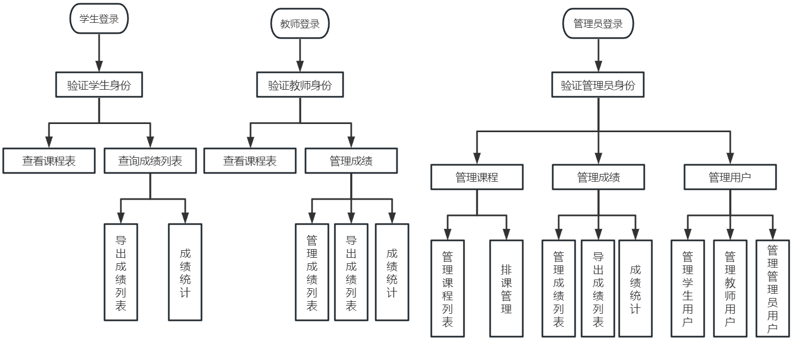
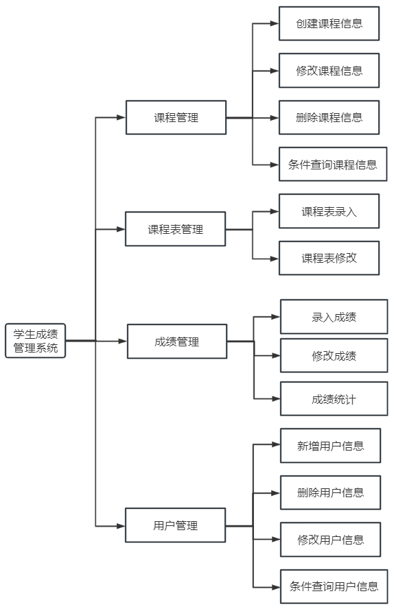

# 需求分析文档
基于SpringBoot + Vue的学生成绩管理系统的设计与实现

---

## 一、项目说明
该项目名称为学生成绩管理系统，技术选型为前后端分离，前端基于Vue.js，后端基于Java语言开发，使用了SpringBoot和MyBatis框架提高开发效率和质量。主要面向高校教育中学生管理、课程管理、教师管理、成绩管理、成绩统计等需求。

---

## 二、项目介绍

### 1、设计背景
实现对学生成绩管理过程中的课程表管理、成绩查询、成绩详情、课程管理、用户管理、账号管理，解决纯手工管理步骤繁琐、容错率低等问题，提高日常成绩管理效率与数据规范化水平。

### 2、核心用户
有大量学生和教学任务的学校成员，包括任课教师、学生、高校领导及管理人员。

---

## 三、业务流程图

---

## 四、功能结构图

---

## 五、任务管理
在规定时间内完成学生成绩管理系统网页版开发，实现本地正常运行，并为后续项目上线奠定基础。

---

## 六、功能需求

###  功能概述
实现用户登录、课程管理、课程表管理、成绩管理、用户管理、账号管理等核心功能。

###  功能点清单

| 功能模块 | 功能点 |
|----------|--------|
| 用户功能 | 用户登录 |
| | 修改密码 |
| 课程管理 | 新增课程信息 |
| | 修改课程信息 |
| | 删除课程信息 |
| | 条件分页查询课程信息 |
| 课程表管理 | 录入课程表 |
| | 修改课程表 |
| 成绩管理 | 录入成绩 |
| | 修改成绩 |
| | 统计成绩 |
| 用户管理 | 新增用户信息 |
| | 修改用户信息 |
| | 删除用户信息 |
| | 条件分页查询用户信息 |

### 功能点描述

#### 1. 课程信息管理
管理员可对课程信息进行新增、删除、修改、条件分页查询。

#### 2. 课程表管理
管理员可对课程表信息进行录入与修改；学生和教师可查询对应课程表。

#### 3. 成绩管理
管理员可进行成绩录入、修改、条件分页查询与统计；学生可查询个人成绩与统计；教师可查询、录入所教课程成绩并进行成绩统计。

#### 4. 用户功能
用户可选择身份（管理员、学生、教师）进行用户名密码登录，登录后可修改个人密码。

#### 5. 用户信息管理
管理员可对用户信息进行新增、删除、修改与条件分页查询。