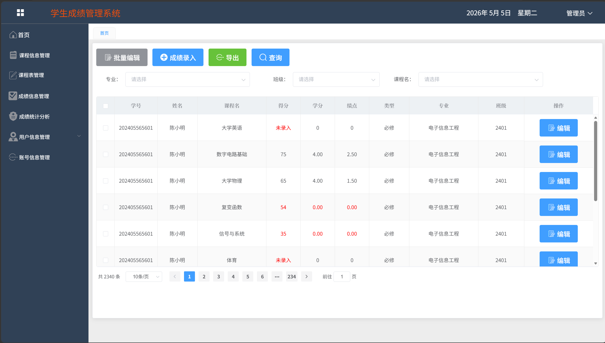

# 软件说明书（中期 / 结项共用主文档）

> 使用说明 
> - 本文档作为**中期检查**与**最终软件说明书**的共用主文档。  
> - **中期阶段**：先完成标注为“中期必填”的内容；标注为“结项补全”的内容可暂留空。  
> - **结项阶段**：在中期版本基础上继续补全，整理后导出为最终doc/docx。  
> - 过程性图片请单独存放在`assets/`目录，正文中使用相对路径引用。  
> - 过程考核以Git中的md增量记录为主，最终排版稿以导出的doc/docx为准。  

---

## 基本信息

**项目名称：** 学生成绩管理系统
**学    院：** 计算机学院
**小组序号：** 04
**成员姓名：** 尹媛 / 刘敏祺 / 朱宁静 / 崔慧敏 / 詹淦栩
**指导老师：** 尹兆远
**当前版本：** 中期版
**更新日期：** 2026年5月6日

---

## 一、项目概述  【中期必填】

### 1. 项目背景
传统学生成绩管理采用Excel/纸质记录，存在查询效率低、数据易出错、跨角色共享困难等问题，本项目开发轻量化在线学生成绩管理系统，实现成绩数字化管理，降低人工成本，提升管理效率。

### 2. 系统目标
中期阶段已明确核心目标：实现多角色登录验证、学生/成绩信息CRUD、多条件成绩查询、学生本人成绩查询，保障核心功能可稳定运行，搭建规范的项目开发目录与Git仓库。

### 3. 开发环境
后端：Spring Boot 3.x、Spring Web、Spring Data JPA
前端：HTML5、CSS3、JavaScript、Bootstrap、Vue
数据库：MySQL 8.0
工具：IntelliJ IDEA、Git、GitHub、Postman
运行环境：JDK 17、Maven 3.8+

---

## 二、需求分析  【中期必填】

### 1. 功能需求
中期阶段已明确核心功能及业务流程：
- 多角色登录：管理员/教师/学生身份鉴权，仅登录用户可操作对应权限功能；
- 学生信息管理：完成学生信息增删改查的业务流程设计，后端接口已开发完成；
- 成绩信息管理：完成成绩录入/修改/删除/查询的业务流程，支持按学号/课程/姓名/班级多条件组合查询；
- 权限控制：不同角色仅可操作对应模块（如学生仅能查本人成绩，教师仅能管理所教课程成绩）。

### 2. 非功能需求
- 性能要求：接口响应时间≤1秒；
- 安全要求：登录鉴权、角色权限隔离，无权限用户无法访问核心接口；
- 兼容性要求：支持Chrome、Edge浏览器。

> 中期要求：功能清单、主要业务流程、基本非功能需求应明确。  
> 结项要求：与最终实现保持一致，删除未完成但未说明的内容。  

---

## 三、系统设计  【中期必填】

### 1. 系统架构
采用B/S三层架构，整体流程：浏览器→前端页面→Spring Boot后端接口→MySQL数据库。

（注：中期阶段已完成架构定稿，架构图已存放至assets目录，核心为前端交互层、后端业务逻辑层、数据库存储层，各层职责清晰。）

### 2. 模块设计
中期阶段已明确核心模块及职责：
- 登录模块：负责用户身份验证、角色识别、权限拦截（刘敏祺负责）；
- 学生信息模块：负责学生信息CRUD接口开发（朱宁静负责）；
- 成绩管理模块：负责成绩CRUD、多条件查询接口开发（朱宁静负责）；
- 前端页面模块：负责登录页/学生管理页/成绩管理页的UI与交互（崔慧敏与尹媛负责）；
- 数据库模块：负责数据表设计、ER图绘制、建表脚本编写（詹淦栩负责）。

### 3. 数据库设计
- E-R图：已完成用户/学生/教师/课程/成绩五大实体的E-R图设计，实体间关联关系（如学生-成绩-课程多对多、教师-课程一对多）已明确；
  
- 主要数据表设计：
  | 表名 | 核心字段 | 备注 |
  |------|----------|------|
  | user | id、username、password、role、create_time | 存储用户账号与角色 |
  | student | id、name、class | 学生基础信息 |
  | teacher | id、name、college | 教师基础信息 |
  | course | id、name、teacher_id | 课程信息，关联教师 |
  | score | id、student_id、course_id、score、exam_time | 成绩信息，关联学生与课程 |
（注：中期阶段已完成数据表定稿，建表SQL脚本已提交至Git仓库。）

> 中期要求：架构、模块、数据库设计基本定稿。  
> 结项要求：与最终系统一致，如有调整需同步更新。  

---

## 四、系统实现  【中期部分填写；结项补全】

### 1. 关键技术
中期阶段已确定核心技术：
- 后端：Spring Boot实现接口开发，Spring Data JPA简化数据库操作，拦截器实现权限控制；
- 前端：Vue实现页面数据绑定，Bootstrap简化UI布局，Axios实现前后端接口联调；
- 数据库：MySQL 8.0实现数据存储，主键自增+外键关联保证数据完整性。

### 2. 界面展示
已完成核心页面原型/开发：
- 登录页：实现多角色登录入口，账号密码校验提示；
  
- 学生管理页：实现学生信息列表、新增/编辑/删除按钮布局；
  

### 3. 核心代码片段
（示例：登录接口核心代码）
```java
// 登录接口核心逻辑（刘敏祺开发）
@PostMapping("/login")
public Result login(@RequestBody User user) {
    // 1. 查询数据库中的用户信息
    User dbUser = userRepository.findByUsername(user.getUsername());
    // 2. 校验账号密码与角色
    if (dbUser == null || !dbUser.getPassword().equals(user.getPassword())) {
        return Result.fail("账号或密码错误");
    }
    // 3. 生成token返回角色信息
    String token = JwtUtil.generateToken(dbUser.getId(), dbUser.getRole());
    return Result.success("登录成功", Map.of("token", token, "role", dbUser.getRole()));
}

> 中期要求：  
> - 可先填写已确定的关键技术；  
> - 可展示已完成页面或原型图；  
> - 核心代码片段可暂不完整。  
>
> 结项要求：  
> - 补全最终关键技术说明；  
> - 使用真实系统界面截图替换原型图；  
> - 展示关键功能的代码片段。  

---

## 五、系统测试  【中期先写方案；结项补全】

### 1. 测试方案
#### （1）测试方法
- **功能测试**：采用黑盒测试为主，白盒测试为辅的方式。针对登录模块、学生信息CRUD、成绩信息CRUD、多条件查询等核心功能，设计测试用例覆盖正常流程、异常流程（如空值提交、非法字符、越权访问）。
- **接口测试**：使用Postman工具对后端所有接口进行自动化测试，验证接口的请求参数、响应格式、返回状态码是否符合预期。
- **兼容性测试**：在Chrome（版本120+）、Edge（版本120+）浏览器中验证前端页面的显示效果和交互功能，确保无样式错乱、功能失效问题。
- **性能测试**：使用Postman的批量请求功能，对核心接口（如成绩查询、登录验证）进行100次/秒的并发请求，验证接口响应时间≤1秒的非功能需求。
- **权限测试**：模拟不同角色（管理员、教师、学生）登录系统，验证各角色仅能访问权限范围内的功能（如学生无法修改成绩、教师无法删除学生信息）。

#### （2）测试范围
| 测试模块       | 核心测试点                                                                 |
|----------------|----------------------------------------------------------------------------|
| 登录模块       | 1. 账号密码正确/错误的登录结果；2. 空账号/空密码提交；3. 不同角色登录后的页面跳转 |
| 学生信息管理   | 1. 学生信息新增（必填项校验）；2. 学生信息修改/删除；3. 学生信息列表查询       |
| 成绩信息管理   | 1. 成绩录入（分数范围校验0-100）；2. 成绩修改/删除；3. 多条件组合查询准确性     |
| 权限控制       | 1. 未登录用户访问功能页的拦截；2. 跨角色操作的拦截；3. 接口级别的权限校验       |
| 前端页面       | 1. 页面元素展示完整性；2. 按钮/输入框交互有效性；3. 不同分辨率下的适配性       |

#### （3）测试思路
1. 编写测试用例：按模块梳理测试点，输出《学生成绩管理系统测试用例表》；
2. 执行测试：先执行单元测试（后端接口独立测试），再执行集成测试（前后端联调测试）；
3. 缺陷记录：使用Excel记录测试中发现的Bug，包含Bug描述、复现步骤、严重级别、所属模块；
4. 回归测试：针对修复后的Bug重新测试，验证是否解决。

### 2. 测试结果
（中期阶段暂未执行完整测试，待第10周前后端联调完成后，补充具体测试用例执行结果、Bug统计数据、通过率等内容）

### 3. 问题与改进
（中期阶段暂未发现实质性Bug，待测试执行后，补充已发现的问题（如接口响应超时、前端表单校验缺失等）及对应的改进措施）

> 中期要求：  
> - 先写测试计划、测试范围、测试思路；  
> - 可列出准备执行的测试用例。  
>
> 结项要求：  
> - 补全真实测试结果；  
> - 记录主要问题及修正情况。  

---

## 六、用户手册  【结项补全】

### 1. 安装部署说明
（说明环境配置与部署步骤）

### 2. 操作指南
（说明系统主要功能的使用方法）

> 中期阶段可暂不写完整。  
> 结项阶段需根据最终系统补全。  

---

## 七、项目总结  【中期可先写阶段总结；结项补全】

### 1. 成果总结
中期阶段已完成项目核心设计与基础功能开发，主要成果如下：
1. 完成项目需求分析、系统架构设计、模块划分与数据库E-R图设计，整体方案稳定可行；
2. 完成后端核心接口开发，包括多角色登录、学生信息管理、成绩信息管理、权限拦截等功能；
3. 完成前端核心页面开发，实现登录、学生管理、成绩查询等页面布局与基础交互；
4. 完成MySQL数据库表结构搭建，实现数据增删改查与关联查询；
5. 完成团队Git仓库搭建，实现规范化协作与版本管理，所有文档与代码均已提交留痕；
6. 完成项目计划书、中期报告、测试方案等文档编写，满足中期检查要求。

### 2. 不足与改进方向
当前中期阶段存在的不足及后续改进计划：
1. 前后端完整联调尚未完成，部分接口数据对接需要优化；
2. 前端页面交互细节、样式美观度仍需进一步完善；
3. 系统测试仅完成方案设计，尚未执行完整用例测试；
4. 部分异常处理、边界值校验逻辑需要补充增强；
5. 后续将重点完成接口联调、功能测试、Bug修复与界面优化，确保系统稳定可用。

### 3. 成员分工表
| 姓名 | 班级 | 学号 | git账号 | 承担任务 |
|------|------|------|---------|----------|
| 尹媛 |  24计科二班  | Sbranch76 | 组长、项目文档、测试方案、前端、Git管理 |
| 刘敏祺 |  24计科二班  | Minqi-Liu | 后端登录模块、身份验证、权限拦截 |
| 朱宁静 |  24计科二班  | LeonardJane | 后端学生管理、成绩管理CRUD接口开发 |
| 崔慧敏 |  24计科二班  | cuihuimin2139 | 前端页面开发、界面交互、接口联调 |
| 詹淦栩 |  24计科三班  | ZXX1217 | 数据库设计、ER图、SQL脚本编写 |

### 4. Git 提交记录
中期阶段已完成多次有效提交，包括：
1. 项目初始化与目录结构搭建；
2. 数据库表结构创建与测试数据导入；
3. 后端登录、学生、成绩等接口开发；
4. 前端页面搭建与基础功能实现；
5. 项目计划书、中期报告、测试方案等文档提交；

> 中期要求：  
> - 可先写阶段成果、当前问题、下一步计划；  
> - 成员分工与Git阶段记录应已对应。  
>
> 结项要求：  
> - 更新为最终完成情况；  
> - 补全最终成员分工与Git记录说明。  

---

## 附录  【中期可留空；结项补全】

- 参考资料
- 源代码仓库链接
- 其他补充材料

---

## 附：推荐的图片与文件组织方式

```text
docs/
  report/
    中期与结项报告.md
    assets/
      fig_architecture.png
      fig_er.png
      fig_ui_login.png
      fig_ui_admin.png
      fig_test_result.png
```

图片在正文中建议这样引用：

```md

```

---

## 附：版本推进建议

- **中期版**：至少完成 第一～三章，并对第四、五、七章写出当前进展。  
- **结项版**：在中期版基础上补全第四～七章，整理后导出为最终软件说明书。  
- **不要中期另写一套、结项再重写一套。**  
