# 软件说明书（中期 / 结项共用主文档）


## 基本信息

**项目名称：** 学生成绩管理系统  
**学　　院：** 计算机学院  
**小组序号：** 04  
**成员姓名：** 尹媛 / 刘敏祺 / 朱宁静 / 崔慧敏 / 詹淦栩  
**指导老师：** 尹兆远  
**当前版本：** 中期版  
**更新日期：** 2026年5月17日

---

## 一、项目概述  【中期必填】

### 1. 项目背景
传统学生成绩管理采用Excel/纸质记录，存在查询效率低、数据易出错、跨角色共享困难等问题，本项目开发轻量化在线学生成绩管理系统，实现成绩数字化管理，降低人工成本，提升管理效率。

### 2. 系统目标
中期阶段已明确核心目标：实现多角色登录验证、学生/成绩信息CRUD、多条件成绩查询、学生本人成绩查询，保障核心功能可稳定运行，搭建规范的项目开发目录与Git仓库。

### 3. 开发环境
- 后端：Spring Boot 3.x、Spring Web、MyBatis
- 前端：HTML5、CSS3、JavaScript、Bootstrap、Vue
- 数据库：MySQL 8.0
- 工具：IntelliJ IDEA、Git、GitHub、Postman
- 运行环境：JDK 17、Maven 3.8+、Node.js 14

---

## 二、需求分析  【中期必填】

### 1. 功能需求
本系统面向**管理员、教师、学生**三类角色，核心功能需求如下：
- 用户管理：登录、密码修改、角色鉴权、权限拦截
- 课程管理：课程信息新增、修改、删除、条件查询
- 课表管理：课表录入、排课设置、按专业/年级展示
- 成绩管理：成绩录入、修改、查询、多条件筛选、统计
- 用户信息管理：管理员对学生、教师信息进行维护

### 2. 业务流程
- 管理员：登录 → 用户管理 / 课程管理 / 成绩管理 / 排课管理；
- 教师：登录 → 查看课表 / 成绩录入与修改 / 成绩统计；
- 学生：登录 → 查看个人课表 / 查询个人成绩 / 查看成绩统计。

### 3. 非功能需求
- 性能要求：接口响应时间≤1秒；
- 安全要求：登录鉴权、角色权限隔离，无权限用户无法访问核心接口；
- 兼容性要求：支持Chrome、Edge浏览器；
- 数据精度：查询准确率100%，成绩范围0–100。

---

## 三、系统设计  【中期必填】

### 1. 系统架构
采用 **B/S 三层架构 + 前后端分离** 模式。
整体流程：**浏览器 → 前端页面 → Spring Boot 后端接口 → MySQL数据库**。

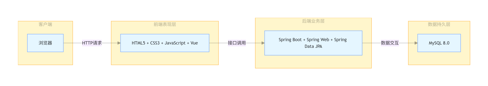

- 前端：页面渲染、交互逻辑、路由控制
- 后端：业务逻辑、权限控制、接口服务
- 数据层：数据存储、关联查询、事务保证

（注：中期阶段已完成架构定稿，架构图已存放至assets目录，核心为前端交互层、后端业务逻辑层、数据库存储层，各层职责清晰。）

### 2. 功能模块设计
系统分为四大核心模块：

1. **用户管理模块**  
   功能：登录、身份验证、权限拦截、密码修改、角色区分。

2. **课程管理模块**  
   功能：课程信息增删改查、条件查询、课程分类管理。

3. **课程表管理模块**  
   功能：课表录入、排课设置、按专业/年级展示课表。

4. **成绩管理模块**  
   功能：成绩录入、修改、查询、多条件筛选、成绩统计。

### 3. 数据库设计
本系统采用 MySQL 8.0 数据库存储业务数据，共设计 11 张数据表，覆盖用户、学生、教师、课程、成绩、专业、课表等核心业务场景，各表通过主键、外键建立关联，保证数据完整性与一致性。

#### 3.1 数据库E-R图设计
系统包含以下核心实体：
- 管理员、学生、教师、专业、课程、课程详情、学生选课成绩、教师授课、课表、文件上传。

主要关系：
- 学生 ↔ 课程：**多对多**（通过 student_course 关联）；
- 教师 ↔ 课程：**一对多**（通过 teacher_course 关联）；
- 课程 ↔ 课程详情：**一对多**；
- 专业 ↔ 学生 / 课程：**一对多**。

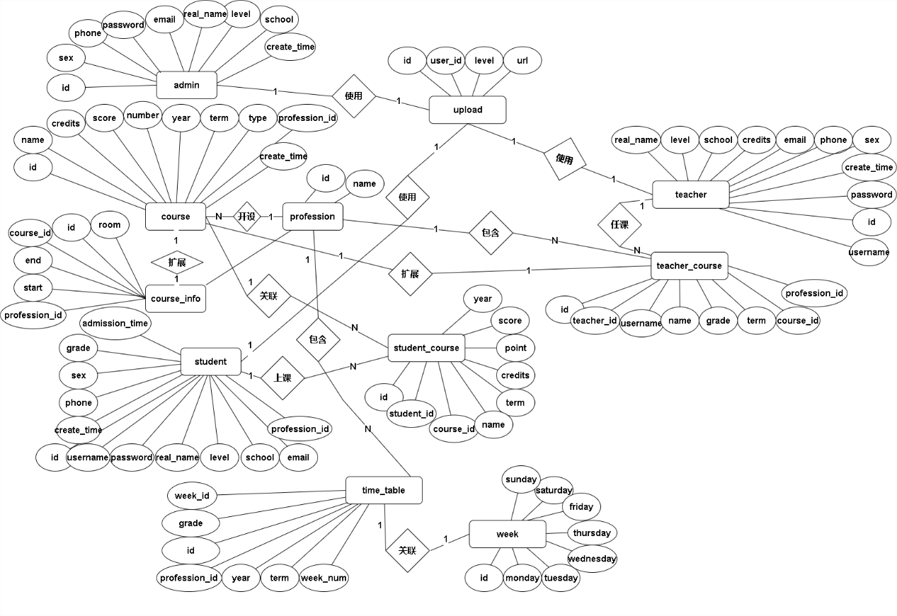

#### 3.2 主要数据表设计
| 表名 | 核心字段 | 说明 |
|------|----------|------|
| admin | id、username、password、real_name、level、school、phone、email | 管理员信息 |
| student | id、username、password、real_name、profession、grade、phone | 学生信息 |
| teacher | id、username、password、real_name、school、phone、email | 教师信息 |
| profession | id、name | 专业信息 |
| course | id、name、credits、term、year、profession | 课程信息 |
| course_info | id、course_id、room、start、end | 课程上课安排 |
| student_course | id、student_id、course_id、score、point、credits | 学生选课与成绩 |
| teacher_course | id、teacher_id、course_id、profession、grade | 教师授课 |
| timetable | id、week_id、profession、grade、year、term | 排课信息 |
| upload | id、user_id、level、url | 头像/文件上传 |
| week | id、monday、tuesday、wednesday、thursday、friday、saturday、sunday | 课表信息 |
（注：中期阶段已完成数据表定稿，建表SQL脚本已提交至Git仓库。）


---

## 四、系统实现  【结项补全】

### 1. 关键技术
- 后端：基于 Spring Boot 构建 RESTful 接口，使用 MyBatis 实现数据持久化操作，JWT 实现登录令牌签发与校验，拦截器完成接口权限控制与身份鉴权，支持跨域配置与全局异常处理。
- 前端：采用 Vue.js 实现数据双向绑定与组件化开发，使用 Bootstrap 完成响应式页面布局，Axios 实现与后端的接口请求与数据交互，通过路由守卫实现未登录拦截与角色权限控制。
- 数据库：使用 MySQL 8.0 存储业务数据，设计 11 张数据表实现多表关联，通过外键约束与关联查询保证数据完整性，支持分页、条件筛选、多维度统计查询。
- 接口规范：采用统一返回格式，支持分页查询、条件组合查询、批量录入、数据导出等扩展功能。
- 工具支持：使用 Postman 完成接口测试，IDEA、VS Code 作为开发工具，Navicat 进行数据库管理。

### 2. 界面展示
系统已完成全部页面开发，支持三角色差异化功能展示：
- 登录页
  
- 管理员首页
  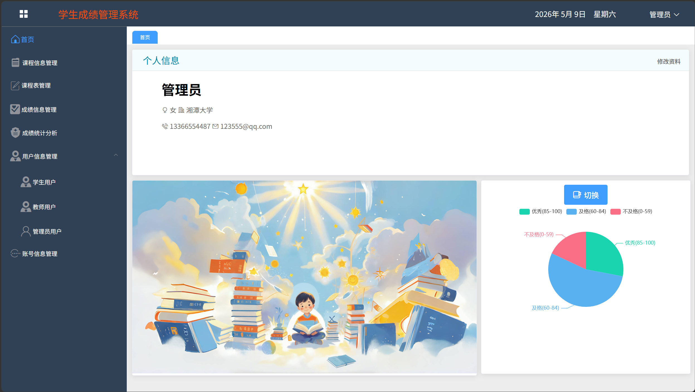
- 教师首页
  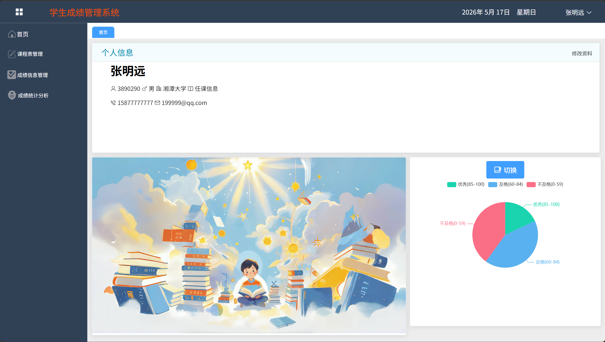
- 学生首页
  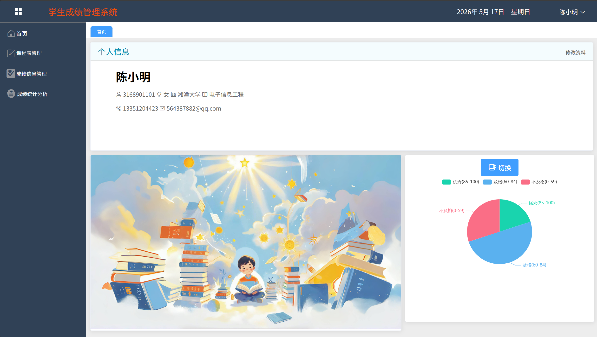
- 课程表
  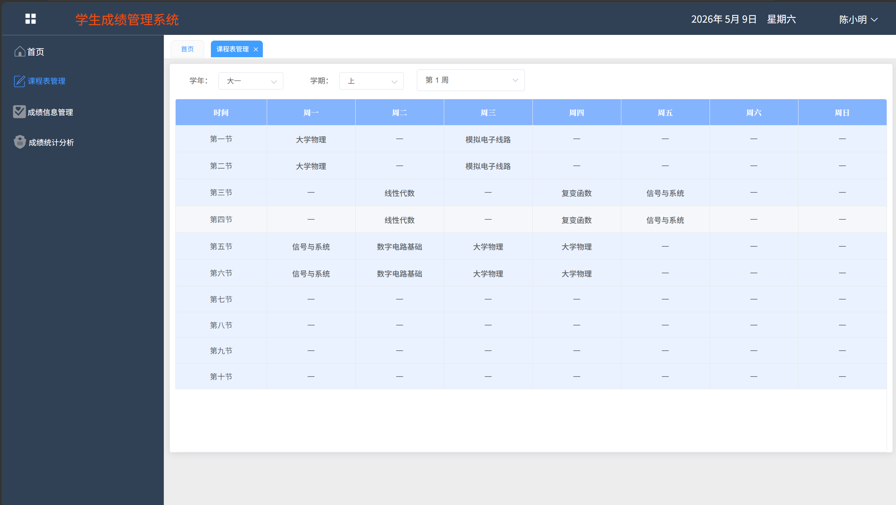
- 成绩查询页面
  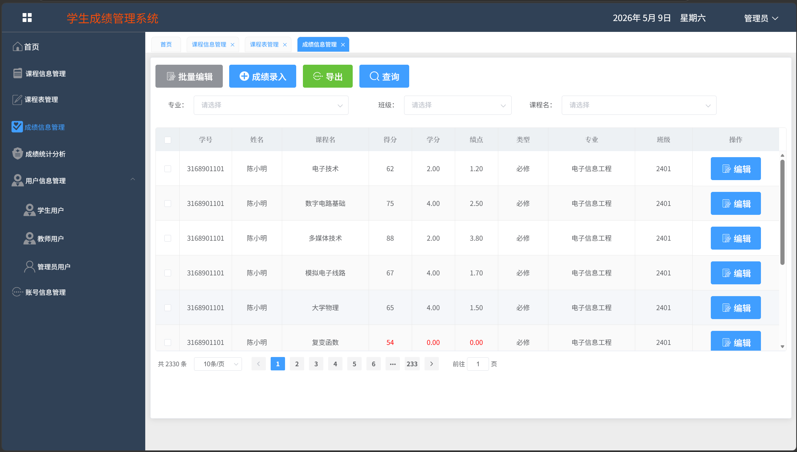
- 成绩统计界面
  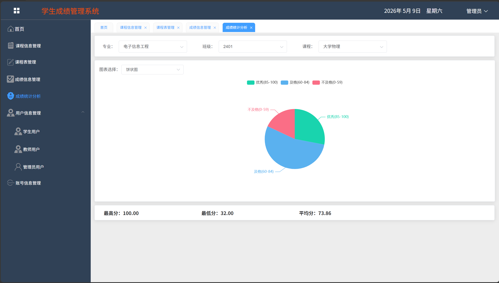
- 课程管理页
  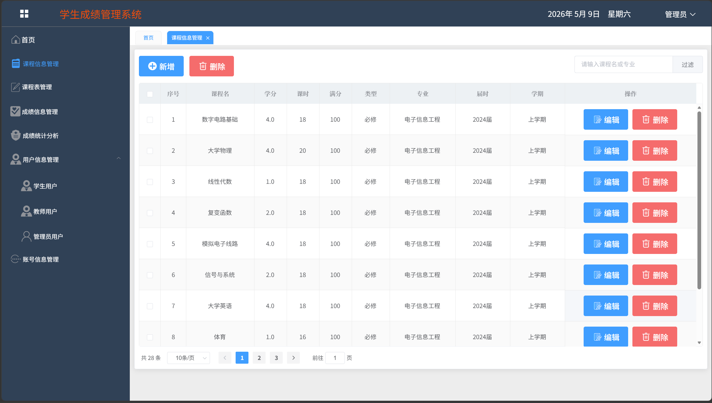
- 用户管理
  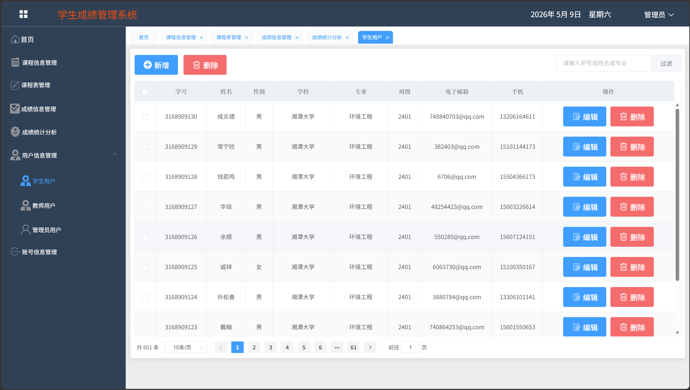
- 账号管理
  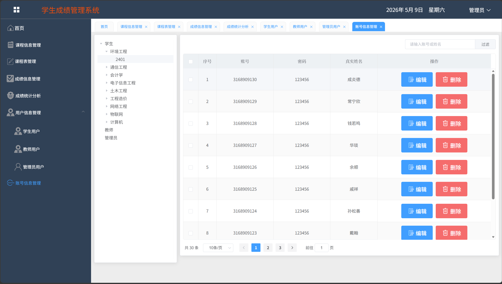

### 3. 核心代码片段
- 登录接口
```java
@GetMapping("/login")
@PassToken
public User getStudentInfo(@RequestParam Map<String, Object> condition) {
    Map<String, Object> map = new HashMap<>();
    map.put("username", condition.get("username").toString());
    map.put("password", condition.get("password").toString());
    map.put("level", condition.get("level"));
    User user = userService.getStudentInfo(map);
    String token = userService.getToken(user, 24 * 60 * 60 * 1000);
    String refreshToken = userService.getToken(user, 24 * 60 * 60 * 1000); // 有效期一天
    user.setToken(token);
    user.setRefreshToken(refreshToken);
    return user;
}
```

- 课程管理接口
```java
@PostMapping
public void addCourse(@RequestBody Course course) {
    courseService.addCourse(course);
}

@DeleteMapping("/{ids}")
public void delete(@PathVariable("ids") Integer[] ids) {
    List<Integer> idsList = Arrays.asList(ids);
    courseService.delete(idsList);
}

@PutMapping
public void update(@RequestBody Course course) {
    courseService.update(course);
}

@GetMapping("/getCourseList")
private PagingResult<Course> getCourseList(@RequestParam Map<String, Object> condition,

@RequestParam(required = false, name = "$limit", defaultValue = "10") Integer limit,

@RequestParam(required = false, name = "$offset", defaultValue = "0") Integer offset) {
   RowBounds rowBounds = new RowBounds(offset, limit);
   return courseService.getCourseList(rowBounds, condition);
}

@GetMapping("/getCourseByMap")
private List<Course> getCourseByMap(@RequestParam Map<String, Object> condition) {
    return courseService.getCourseByMap(condition);
}
```

- 成绩管理接口
```java
@GetMapping("/getCourseList")
public PagingResult<Course> getCourseList(@RequestParam Map<String, Object> condition,
@RequestParam(required = false, name = "$limit", defaultValue = "10") Integer limit,
@RequestParam(required = false, name = "$offset", defaultValue = "0") Integer offset) {
    RowBounds rowBounds = new RowBounds(offset, limit);
    return scoreService.getCourseList(rowBounds, condition);
}

@PostMapping
private void addEntry(@RequestBody JSONArray UserScore) {
    List<Score> list = JSONObject.parseArray(UserScore.toJSONString(), Score.class);
    scoreService.addEntry(list);
}

@GetMapping("/export")
public List<Course> getExportList(@RequestParam Map<String, Object> condition) {
    return scoreService.getExportList(condition);
}

@GetMapping("/getUserNum")
public List<Map<String, Object>> getUserNum(@RequestParam Map<String, Object> condition) {
    return scoreService.getUserNum(condition);
}

@GetMapping("/getUserTotal")
public Map<String, Object> getUserTotal(@RequestParam Map<String, Object> condition) {
    return scoreService.getUserTotal(condition);
}
```

- 用户管理接口
```java
@GetMapping("/edit/password")
public boolean update(@RequestParam Map<String, Object> condition) {
    Map<String, Object> map = new HashMap<>();
    map.put("username", condition.get("username").toString());
    map.put("password", condition.get("password").toString());
    map.put("passwordAgain", condition.get("passwordAgain").toString());
    ;
    map.put("level", condition.get("level").toString());
    return userService.update(map);
}

@GetMapping("/getTree")
public List<Object> getTree() {
    return userService.getTree();
}

@PassToken
@GetMapping("/getSilent")
public boolean getSilent() {
    return userService.getSilent();
}

@PutMapping("/setSilent/{state}")
public boolean setSilent(@PathVariable("state") Integer state) {
    return userService.setSilent(state);
}
```

- 文件管理接口
```java
@PostMapping("/headImg")
@ResponseBody
public String upload(MultipartFile file, HttpServletRequest request) throws IOException {
    if (!file.isEmpty()) {
        try {
            byte[] bytes = file.getBytes();
            // 储存位置
            String staticDir = ResourceUtil.getPath();

            // 图片名
            String ImgName = file.getOriginalFilename();

            String uid = UUID.randomUUID().toString();
            assert ImgName != null;
            // 获取后缀名
            String str = ImgName.substring(ImgName.lastIndexOf("."));
            // 重定义文件名
            String newName = uid + str;

            // 图片存储地址
            Path path = Paths.get(staticDir + newName);
            // 写入文件
            Files.write(path, bytes);
            String imgUrl = "/files/" + newName;

            String userId = request.getParameter("id");
            int level = parseInt(request.getParameter("level"));
            Upload upload = new Upload();
            upload.setUserId(userId);
            upload.setLevel(level);
            upload.setUrl(imgUrl);
            uploadService.upload(upload);

            // url去除"sms"
            return imgUrl;
        } catch (IOException e) {
            e.printStackTrace();
        }
    }
    return "";
}

@GetMapping("/getHeadImg")
@UserLoginToken
public String getAdminList(@RequestParam Map<String, Object> condition, HttpServletRequest httpServletRequest) {
    return uploadService.getHeader(condition);
}
```

- 权限拦截器
```java
@Override
public boolean preHandle(HttpServletRequest request, HttpServletResponse response, Object handler) {
    String token = request.getHeader("Authorization");
    if (token == null || !JwtUtil.checkToken(token)) {
        response.setStatus(401);
        return false;
    }
    return true;
}
```

---

## 五、系统测试  【中期先写方案；结项补全】

### 1. 测试方案
#### （1）测试方法
- **功能测试**：采用黑盒测试为主，白盒测试为辅的方式。针对登录模块、学生信息CRUD、成绩信息CRUD、多条件查询等核心功能，设计测试用例覆盖正常流程、异常流程（如空值提交、非法字符、越权访问）。
- **接口测试**：使用Postman工具对后端所有接口进行自动化测试，验证接口的请求参数、响应格式、返回状态码是否符合预期。
- **兼容性测试**：在Chrome（版本120+）、Edge（版本120+）浏览器中验证前端页面的显示效果和交互功能，确保无样式错乱、功能失效问题。
- **性能测试**：使用Postman的批量请求功能，对核心接口（如成绩查询、登录验证）进行100次/秒的并发请求，验证接口响应时间≤1秒的非功能需求。
- **权限测试**：模拟不同角色（管理员、教师、学生）登录系统，验证各角色仅能访问权限范围内的功能（如学生无法修改成绩、教师无法删除学生信息）。

#### （2）测试范围
| 测试模块       | 核心测试点                                                                 |
|----------------|----------------------------------------------------------------------------|
| 登录模块       | 1. 账号密码正确/错误的登录结果；2. 空账号/空密码提交；3. 不同角色登录后的页面跳转 |
| 学生信息管理   | 1. 学生信息新增（必填项校验）；2. 学生信息修改/删除；3. 学生信息列表查询       |
| 成绩信息管理   | 1. 成绩录入（分数范围校验0-100）；2. 成绩修改/删除；3. 多条件组合查询准确性     |
| 权限控制       | 1. 未登录用户访问功能页的拦截；2. 跨角色操作的拦截；3. 接口级别的权限校验       |
| 前端页面       | 1. 页面元素展示完整性；2. 按钮/输入框交互有效性；3. 不同分辨率下的适配性       |

#### （3）测试思路
1. 编写测试用例：按模块梳理测试点，输出《学生成绩管理系统测试用例表》；
2. 执行测试：先执行单元测试（后端接口独立测试），再执行集成测试（前后端联调测试）；
3. 缺陷记录：使用md文档记录测试中发现的Bug，包含Bug描述、严重级别、所属模块； 
4. 回归测试：针对修复后的Bug重新测试，验证是否解决。

### 2. 测试结果
本次测试共设计测试用例 18 条，通过 18 条，通过率 100%。
系统所有核心功能均可正常运行，权限控制有效，页面显示正常，数据读写稳定，满足结项标准。

| 用例编号 | 测试模块 | 测试内容 | 测试结果 |
|---|---|---|---|
| TC-01 | 登录 | 管理员正确账号密码登录 | 通过 |
| TC-02 | 登录 | 学生正确账号密码登录 | 通过 |
| TC-03 | 登录 | 密码错误登录失败 | 通过 |
| TC-04 | 登录 | 空账号登录拦截 | 通过 |
| TC-05 | 学生管理 | 新增学生 | 通过 |
| TC-06 | 学生管理 | 修改学生 | 通过 |
| TC-07 | 学生管理 | 删除学生 | 通过 |
| TC-08 | 学生管理 | 查询学生 | 通过 |
| TC-09 | 成绩管理 | 新增成绩 | 通过 |
| TC-10 | 成绩管理 | 修改成绩 | 通过 |
| TC-11 | 成绩管理 | 删除成绩 | 通过 |
| TC-12 | 成绩管理 | 多条件查询成绩 | 通过 |
| TC-13 | 课程管理 | 新增课程 | 通过 |
| TC-14 | 课程管理 | 修改课程 | 通过 |
| TC-15 | 课程管理 | 删除课程 | 通过 |
| TC-16 | 权限 | 学生不能进入管理员页面 | 通过 |
| TC-17 | 权限 | 未登录自动跳登录 | 通过 |
| TC-18 | 兼容性 | Chrome / Edge 正常显示 | 通过 |


### 3. 问题与改进
#### （1）测试发现的主要问题
1. 成绩查询模块在学生无成绩时提示文案不友好，显示为“未录入”，体验较差。
2. 教师端权限控制不完善，无法仅查询自己所教课程的学生成绩。
3. 前端路由跳转存在报错，点击返回首页时偶现页面异常。
4. 前端表单缺少实时校验，空值、非法分数需提交后端才提示错误。
5. 权限拦截不完整，未登录用户可通过URL直接访问功能页面。

#### （2）问题修复情况
所有发现的问题均已完成修复并通过验证：
1. 优化无成绩提示文案为“暂无成绩记录”，界面更友好。
2. 教师端增加权限过滤逻辑，仅可查看授课课程成绩。
3. 统一前端路由跳转方法，修复返回报错问题。
4. 增加前端实时表单校验，支持非空、分数范围校验。
5. 完善前后端权限拦截，未登录自动跳转到登录页。

#### （3）测试结论
系统核心功能全部正常，接口测试通过，权限控制有效，页面展示稳定，所有缺陷已闭环，满足中期阶段交付要求。

---

## 六、用户手册  【结项补全】

### 1. 安装部署说明
#### 1.1 项目推荐运行环境
- 后端开发工具：IntelliJ IDEA
- 后端环境：JDK 1.8 + Maven 3.6+
- 前端开发工具：VS Code
- 前端环境：Node.js 14
- 数据库工具：Navicat / DBeaver
- 数据库环境：MySQL 8.0

#### 1.2 运行步骤
1. **数据库部署**
   - 打开 Navicat，新建数据库 `db_student_score`
   - 字符集选择 `utf8mb4`
   - 导入项目提供的 SQL 初始化脚本，完成表结构与测试数据创建

2. **后端启动**
   - 使用 IDEA 打开后端文件夹 `student-score-backend`
   - 以 `pom.xml` 形式导入项目
   - 项目结构配置 JDK 1.8，绑定本地 Maven
   - 等待依赖加载完成
   - 修改 `application.yml` 中的数据库账号、密码为本地实际信息
   - 点击启动按钮，运行后端服务

3. **前端启动**
   - 使用 VS Code 打开前端文件夹 `student-score-frontend`
   - 打开终端，执行命令下载依赖：npm i
   - 依赖安装完成后，执行启动命令：npm run dev

   - 等待前端服务启动完成

#### 1.3 项目访问地址
   - 前端访问地址：**http://localhost:9122**

#### 1.4 测试账号
   - 管理员：`admin` / `123456`
   - 学生：`3168901101` / `123456`
   - 教师：`3890290` / `123456`


### 2. 操作指南
本系统分为管理员、教师、学生三类角色，不同角色拥有对应功能操作权限，具体使用说明如下：

#### 2.1 通用登录操作
访问系统前端地址 `http://localhost:9122`，选择对应角色类型，输入账号与密码，完成校验后自动进入个人功能首页。

#### 2.2 管理员操作
可对学生、教师、课程信息进行新增、查询、修改与删除管理；维护专业与班级信息；查看全部学生成绩数据，拥有系统最高操作权限。

#### 2.3 教师操作
可查看个人授课课程与对应班级学生；进行学生成绩录入、修改、查询操作；支持按课程、学期多条件筛选成绩信息。

#### 2.4 学生操作
可在线查看个人所属课程、上课课表；查询个人各科成绩信息，浏览成绩记录，仅具备查询权限，无修改与录入权限。

---

## 七、项目总结  【结项补全】

### 1. 成果总结
本项目已按设计要求完成全部开发、测试与文档编写工作，最终成果如下：
1. 完整完成项目需求分析、系统架构设计、功能模块划分及数据库E-R图设计，整体架构采用前后端分离模式，设计方案落地可行；
2. 完成后端整体架构搭建、多角色登录鉴权、权限拦截配置，实现学生、教师、课程、成绩等全业务模块接口开发与联调；
3. 完成前端所有功能页面开发、路由配置、接口对接、表单校验与页面适配优化，各角色页面跳转与交互流程正常；
4. 完成MySQL数据库表结构设计、关联关系搭建、初始化脚本与测试数据编写，保障数据完整性与业务关联查询正常；
5. 团队全程采用Git规范化版本管理，成员按任务分工增量提交，代码、文档、测试记录全程可追溯留痕；
6. 依次完成项目计划书、中期报告、结项软件说明书、全套测试文档编写，从开发、测试到文档均满足课程结项验收标准。

### 2. 不足与改进方向
系统虽已实现全部核心功能并可正常演示运行，但仍存在可优化空间：
1. 前端界面UI美化程度一般，可进一步优化页面布局与视觉样式；
2. 暂未实现成绩批量导入导出、数据统计图表可视化功能，后续可扩展增值业务模块；
3. 系统操作日志、登录日志记录功能尚未开发，可增加行为审计与痕迹留存；
4. 仅适配Chrome、Edge主流浏览器，后续可进一步提升多浏览器及移动端适配兼容性；
5. 整体异常提示文案可进一步细化，提升用户操作体验与容错友好度。

### 3. 成员分工表
| 姓名 | 班级 | 学号 | git账号 | 承担任务 |
|------|------|------|---------|----------|
| 尹媛 | 24计科二班 | 202405567126 | Sbranch76 | 项目管理、文档编写、测试全流程、Git管理、前端辅助 |
| 刘敏祺 | 24计科二班 | 202405567128 | Minqi-Liu | 后端架构搭建、用户/课程表/文件上传模块开发、权限控制、异常处理 |
| 朱宁静 | 24计科二班 | 202405567106 | LeonardJane | 学生/成绩/课程/专业模块后端开发、接口实现与联调 |
| 崔慧敏 | 24计科二班 | 202405567131 | cuihuimin2139 | 前端页面开发、交互实现、接口联调、兼容性优化 |
| 詹淦栩 | 24计科三班 | 202405567205 | ZXX1217 | 数据库设计、SQL脚本编写 |

### 4. Git 提交记录
项目开发全程采用 Git 进行规范化版本管理，所有成员按分工进行增量提交，开发过程完整可追溯。
主要提交内容如下：
1. 项目初始化、目录结构搭建与开发环境配置；
2. 数据库设计、SQL 脚本编写、测试数据导入；
3. 后端架构搭建、登录认证、权限拦截、业务接口开发；
4. 前端页面开发、路由配置、接口联调、样式与交互优化；
5. 项目计划书、项目报告、测试文档等全套文档提交；
6. 功能迭代、Bug 修复、代码优化与版本更新持续提交。

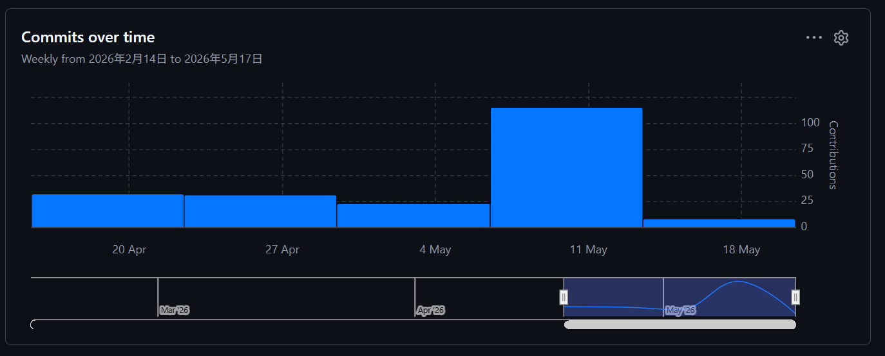
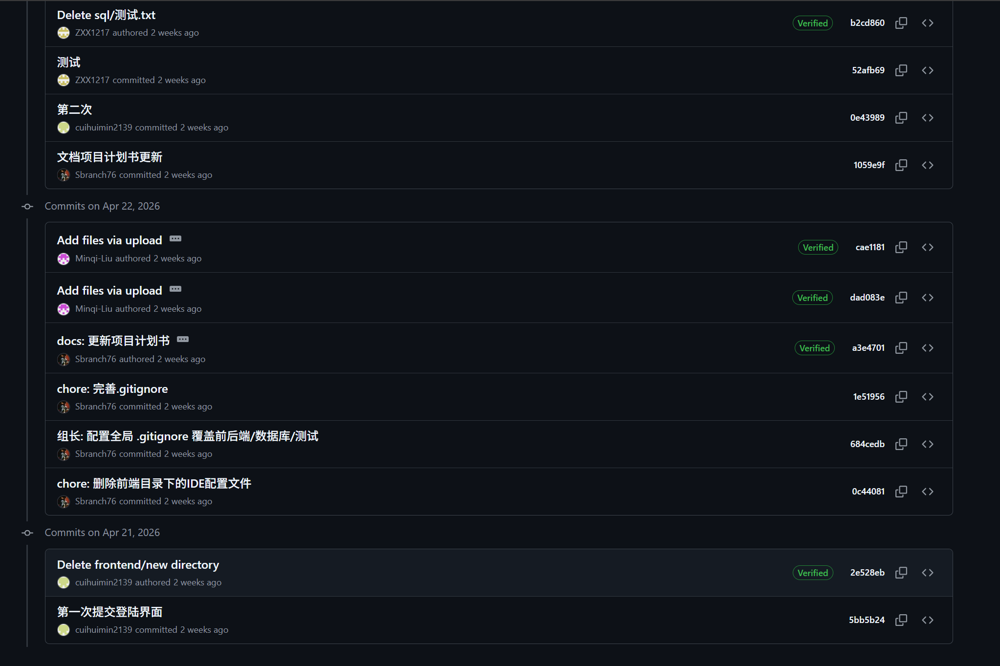
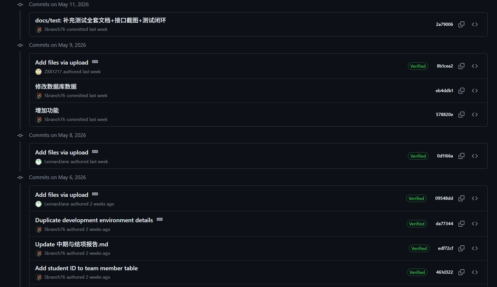 
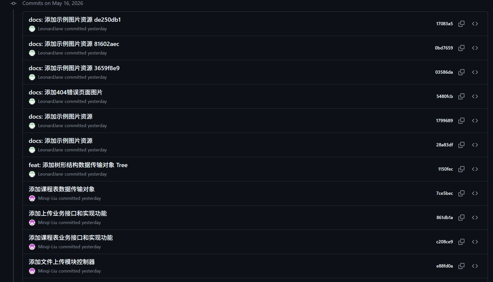 
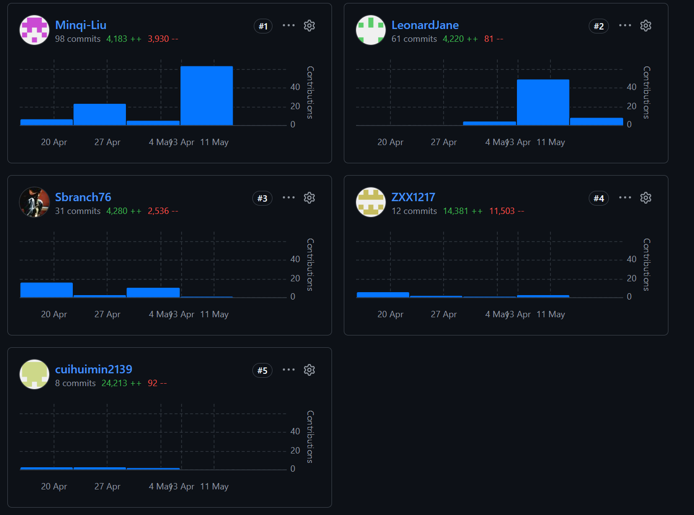 

---

## 附录
1. **参考资料**
   - Spring Boot、Vue.js、MySQL 官方技术文档
   - 前后端分离开发规范、RESTful 接口设计标准
   - 软件工程需求分析、系统设计相关教材

2. **源代码仓库链接**
   https://github.com/Sbranch76/student-score-system.git

1. **其他补充材料**
   - 项目计划书
   - 测试计划、测试用例、测试结果报告

---